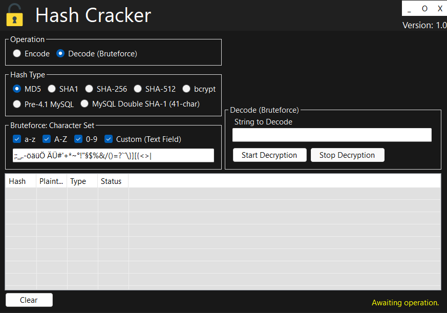

# Hash Cracker

> ⚠️ Do not use this tool for hacking, unauthorized access, or any criminal activity. Misuse may result in data loss, system inaccessibility, or legal consequences. Always comply with local laws and use only on systems you own or are authorized to manage.

## 🔍 Introduction

> [!TIP]
> No new features are currently planned for this project. However, users are welcome to create issues or feature requests, which will be reviewed and responded to within 1–3 weeks.

A fast and flexible Windows tool for encoding and brute-forcing password hashes across multiple algorithms.

## ✨ Features

- Supports MD5, SHA1, SHA256, SHA512, bcrypt, and MySQL hash types
- Customizable character sets for brute-force attacks
- Real-time progress and status updates
- Easy-to-use graphical interface
- Hash result history logging

## 🖱️ Usage Information

- Copy the prefered version folder from _releases/_executable/VERSION to your computer.
- Ensure all files in the source folder remain together.
- Run hashcracker.exe.
- Use the application.

## ❓ Support Channels

If you encounter any issues or have questions while using this software, feel free to contact us:

- **GitHub Issues** is the main platform for reporting bugs, asking questions, or submitting feature requests: [https://github.com/bugfishtm/windows-hash-cracker/issues](https://github.com/bugfishtm/windows-hash-cracker/issues)
- **Discord Community** is available for live discussions, support, and connecting with other users: [Join us on Discord](https://discord.com/invite/xCj7AEMmye)  
- **Email support** is recommended only for urgent security-related issues: [security@bugfish.eu](mailto:security@bugfish.eu)
- **Tutorial Video** for a full walkthrough, at [https://www.youtube.com/playlist?list=PL6npOHuBGrpDlS6CCHIUDz5O9mOnH7-7E](https://www.youtube.com/playlist?list=PL6npOHuBGrpDlS6CCHIUDz5O9mOnH7-7E).

## 📢 Spread the Word

Help us grow by sharing this project with others! You can:  

* **Tweet about it** – Share your thoughts on [Twitter/X](https://twitter.com) and link us!  
* **Post on LinkedIn** – Let your professional network know about this project on [LinkedIn](https://www.linkedin.com).  
* **Share on Reddit** – Talk about it in relevant subreddits like [r/programming](https://www.reddit.com/r/programming/) or [r/opensource](https://www.reddit.com/r/opensource/).  
* **Tell Your Community** – Spread the word in Discord servers, Slack groups, and forums.  

## 📁 Repository Structure 

This table provides an overview of key files and folders related to the repository. Click on the links to access each file for more detailed information. If certain folders are missing from the repository, they are irrelevant to this project.

|Document Type|Description|
|----|-----|
| .github | Folder with github setup files. |
| [.github/CODE_OF_CONDUCT.md](./.github/CODE_OF_CONDUCT.md) | The community guidelines. |
| _changelogs | Folder for changelogs. |
| _images | Folder for project images. |
| _packages | Folder for installable packages mostly for suitefish-cms. |
| _releases | Folder for releases. |
| _screenshots | Folder with project screenshots. |
| _source | Folder with the source code. |
| _videos | Folder with videos related to the project. |
| .gitattributes | Repository setting file. Only for development purposes. |
| .gitignore | Repository ignore file. Only for development purposes. |
| docs | Folder for Github Pages Documentation. |
| README.md | Readme of this project. You are currently looking at this file. |
| repository_reset.bat | File to reset this repository. Only for development purposes. |
| repository_update.bat | File to update this repository. Only for development purposes. |
| [CONTRIBUTING.md](CONTRIBUTING.md) | Information for contributors. | 
| [CHANGELOG.md](CHANGELOG.md) | Information about changelogs. | 
| [SECURITY.md](SECURITY.md) | How to handle security issues. |
| [LICENSE.md](LICENSE.md) | License of this project. |

## 📑 Changelog Information

Refer to the `_changelogs` folder for detailed insights into the changes made across different versions. The changelogs are available in **HTML format** within this folder, providing a structured record of updates, modifications, and improvements over time. Additionally, **GitHub Releases** follow the same structure and also include these changelogs for easy reference.

## 🤝 Community Guidelines

We’re on a mission to create groundbreaking solutions, pushing the boundaries of technology. By being here, you’re an integral part of that journey. 

**Positive Guidelines:**
- Be kind, empathetic, and respectful in all interactions.
- Engage thoughtfully, offering constructive, solution-oriented feedback.
- Foster an environment of collaboration, support, and mutual respect.

**Unacceptable Behavior:**
- Harassment, hate speech, or offensive language.
- Personal attacks, discrimination, or any form of bullying.
- Sharing private or sensitive information without explicit consent.

Let’s collaborate, inspire one another, and build something extraordinary together!

## 🛡️ Warranty and Security

I take security seriously and appreciate responsible disclosure. If you discover a vulnerability, please follow these steps:

- **Do not** report it via public GitHub issues or discussions. Instead, please contact the [security@bugfish.eu](mailto:security@bugfish.eu) email address directly.   
- Provide as much detail as possible, including a description of the issue, steps to reproduce it, and its potential impact.  

I aim to acknowledge reports within **2–4 weeks** and will update you on our progress once the issue is verified and addressed.

This software is provided as-is, without any guarantees of security, reliability, or fitness for any particular purpose. We do not take responsibility for any damage, data loss, security breaches, or other issues that may arise from using this software. By using this software, you agree that We are not liable for any direct, indirect, incidental, or consequential damages. Use it at your own risk.

## 📜 License Information

The license for this software can be found in the [LICENSE.md](LICENSE.md) file. Third-party licenses are located in the ./_licenses folder. The software may also include additional licensed software or libraries.

🐟 Bugfish 