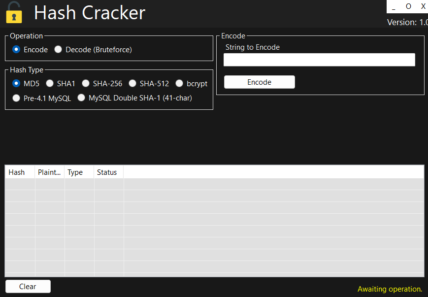

# Hash Cracker

Password hash brute-force tool with multi-algorithm support.

!!! danger "Do not use this tool for hacking, unauthorized access, or any criminal activity. Misuse may result in data loss, system inaccessibility, or legal consequences. Always comply with local laws and use only on systems you own or are authorized to manage."

-----------

## Introduction

A Windows application for brute-forcing and analyzing password hashes using customizable character sets and multiple hash algorithms.

- Supports MD5, SHA1, SHA256, SHA512, bcrypt, and MySQL hash types
- Customizable character sets for brute-force attacks
- Real-time progress and status updates
- Easy-to-use graphical interface
- Hash result history logging

  

--------

## Spread the Word

Help us grow by sharing this project with others! You can:  

* Tweet about it – Share your thoughts on [Twitter/X](https://twitter.com) and link us!  
* Post on LinkedIn – Let your professional network know about this project on [LinkedIn](https://www.linkedin.com).  
* Share on Reddit – Talk about it in relevant subreddits like [r/programming](https://www.reddit.com/r/programming/) or [r/opensource](https://www.reddit.com/r/opensource/).  
* Tell Your Community – Spread the word in Discord servers, Slack groups, and forums.  
