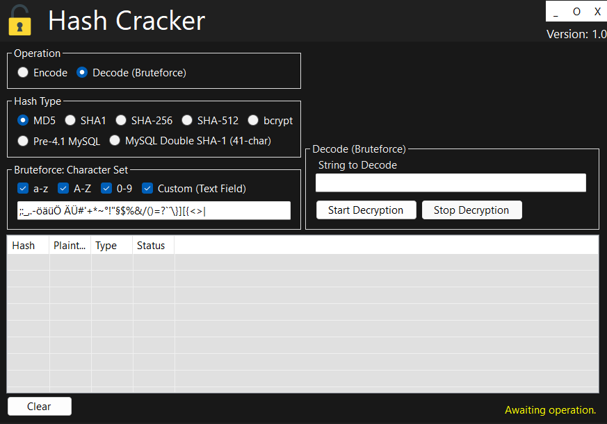

# Screenshots

This section showcases key screenshots of the project, highlighting its features and user interface. Explore these visuals to get a better understanding of how the software works and looks in action.

-------------------

  
  

